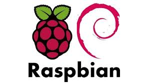

# Net-Pi
<<<<<<< HEAD
Net-Pi is a personal network security system run on a Raspberry Pi 4 model, with Pi-Hole, customizable Snort rules, IP tables, and Sweet Security to form a secure network firewall. The goal of this project is to provide a safer local area network (LAN) for all users. The benefit of implementing this idea on a Raspberry Pi is that it makes it more available to the everyday user, as opposed to the more hard-core PC user.
=======
Net-Pi is a personal network security system run on a Raspberry Pi 4 model, with Pi-Hole, customizable Snort rules, an email alerting system, and a personalized network monitor to form a secure network firewall. The goal of this project is to provide a safer local area network (LAN) for all users. The benefit of implementing this idea on a Raspberry Pi is that it makes it more available to the everyday user, as opposed to the more hard-core PC user.
>>>>>>> bf18e3a1e6e1ff752d54a289d315457a20d0dd40
